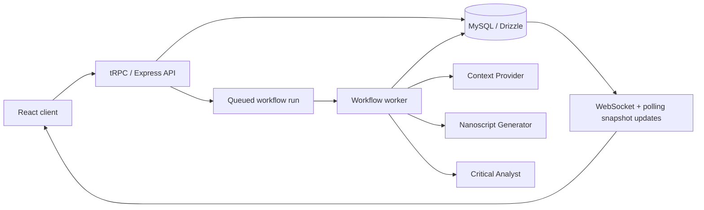

# Multi-Agent AI Workflow Orchestrator

[](https://www.typescriptlang.org/)
[](https://www.docker.com/)
[](https://trpc.io/)
[](https://ollama.ai/)
[](https://react.dev/)
[](https://vitejs.dev/)

Build software tasks through a three-agent workflow that gathers context, generates code, and critiques the result before presenting artifacts in a live dashboard.

## What the app does

When a user launches a workflow, the system runs three specialized agents in sequence:

1. **Context Provider** gathers domain constraints, relevant examples, and implementation hints.
2. **Nanoscript Generator** produces the first code draft using the enriched context.
3. **Critical Analyst** reviews the output for correctness, security concerns, and improvements.

Workflow runs are persisted in MySQL, exposed through tRPC, and updated in real time through WebSocket subscriptions plus persisted lifecycle events.

## Architecture



### Execution lifecycle

Every run moves through the same high-level stages:

1. `setup`
2. `initialization`
3. `orchestration`
4. `synchronization`

The API creates a run in `pending` state, a worker claims it, the engine persists steps and artifacts, and the monitor page streams both live and persisted lifecycle updates.

## Key features

### Multi-agent workflow

- Three specialized agents with configurable prompts and models.
- Saved workflow configurations and agent presets.
- Persisted artifacts for context, generated code, analysis, and final output.

### Live monitoring

- WebSocket subscriptions on `/api/trpc`.
- Persisted lifecycle events for queue, worker, engine, and step state changes.
- Derived metrics such as queue latency, execution duration, and time to first artifact.

### Flexible LLM support

- Works with any OpenAI-compatible endpoint.
- Supports Ollama for fully local development.
- Model discovery against Ollama-native and OpenAI-compatible APIs.

### Worker-based execution

- Workflow runs are queued instead of executing inline in the web request.
- Embedded worker support in development.
- Dedicated worker process support for Docker or production-style setups.

### Safer-by-default runtime

- Ownership checks on workflow child resources.
- Request body limited to `2mb`.
- Production security headers including `Content-Security-Policy`.
- Run-creation guard rails for active-run limits, burst limits, and model validation.

## Requirements

- Node.js 20+
- pnpm 10+
- MySQL 8+
- Docker and Docker Compose for containerized setup
- An LLM endpoint (Ollama or any OpenAI-compatible provider)

## Quick start with Docker

### 1. Clone the repository

```bash
git clone <repository-url>
cd multi-agent-ai-workflow
```

### 2. Create `.env`

Start from the example file:

```bash
cp .env.example .env
```

At minimum, configure:

- `JWT_SECRET`
- `BUILT_IN_FORGE_API_KEY`
- optionally `BUILT_IN_FORGE_API_URL`

For Ollama on the host machine, a typical configuration is:

```env
BUILT_IN_FORGE_API_URL=http://localhost:11434/v1
BUILT_IN_FORGE_API_KEY=ollama
JWT_SECRET=replace-with-a-long-random-secret-of-at-least-32-characters
```

### 3. Start the stack

```bash
docker-compose up -d --build
```

The compose file starts:

- MySQL
- the web application
- a dedicated workflow worker

### 4. Open the app

Visit `http://localhost:3005`.

If `OAUTH_SERVER_URL` is empty, development login is available through `/api/dev-login` and the UI login flow.

## Local development

### 1. Install dependencies

```bash
pnpm install
```

### 2. Configure environment

Use `.env.example` as the template and provide a reachable MySQL instance plus LLM configuration.

### 3. Apply database changes

```bash
pnpm db:push
```

### 4. Start the app

```bash
pnpm dev
```

The dev server starts on `http://localhost:3000` by default and will automatically pick the next open port if `3000` is busy.

### 5. Optional: run a dedicated worker locally

If you want the web process and the worker process separated in development:

```bash
# in .env
WORKFLOW_EMBEDDED_WORKER=false

# terminal 1
pnpm dev

# terminal 2
pnpm dev:worker
```

## Environment variables

| Variable | Required | Description |
| --- | --- | --- |
| `DATABASE_URL` | Yes | MySQL connection string. |
| `BUILT_IN_FORGE_API_KEY` | Yes | API key for the configured LLM provider. Use `ollama` for local Ollama setups. |
| `BUILT_IN_FORGE_API_URL` | No | Base URL for the OpenAI-compatible provider. If omitted, the app falls back to Manus Forge. |
| `JWT_SECRET` | Yes | Cookie/session signing secret. Production requires a strong non-default value. |
| `OAUTH_SERVER_URL` | No | Enables OAuth callback flow when set. Leave empty for dev login mode. |
| `OWNER_OPEN_ID` | No | OpenID that should receive the admin role. |
| `VITE_APP_ID` | No | Application identifier used by the frontend. |
| `WORKFLOW_EMBEDDED_WORKER` | No | Enables the in-process worker. Defaults to `true` outside production. |
| `WORKFLOW_WORKER_ID` | No | Explicit worker identifier. Defaults to `worker-<pid>`. |
| `WORKFLOW_WORKER_POLL_INTERVAL_MS` | No | Worker polling interval in milliseconds. |
| `WORKFLOW_WORKER_STALE_RUN_MS` | No | Threshold after which stale `running` runs are recovered as failed. |
| `WORKFLOW_RUN_CREATE_WINDOW_MS` | No | Sliding window used for run-creation burst limiting. |
| `WORKFLOW_RUN_CREATE_MAX_PER_WINDOW` | No | Maximum runs allowed per user inside the sliding window. |
| `WORKFLOW_RUN_ACTIVE_LIMIT` | No | Maximum number of `pending` + `running` runs per user. |

## Scripts

| Command | Purpose |
| --- | --- |
| `pnpm dev` | Start the web server in watch mode. |
| `pnpm dev:worker` | Start the worker in watch mode. |
| `pnpm worker` | Run the worker once outside watch mode. |
| `pnpm build` | Build the client and bundle both server entrypoints. |
| `pnpm start` | Start the built web server. |
| `pnpm start:worker` | Start the built worker process. |
| `pnpm check` | Run TypeScript type checking. |
| `pnpm test` | Run the Vitest suite. |
| `pnpm db:push` | Generate and apply Drizzle migrations. |
| `pnpm db:seed` | Seed sample data. |
| `pnpm test:llm` | Verify LLM connectivity. |

## Repository layout

```text
client/          React SPA
server/          Express, tRPC, workers, services, agents
shared/          Shared constants and types
drizzle/         Schema and SQL migrations
docs/            User and API documentation
docs_dev/        Audit and engineering notes
```

## Documentation

| Document | Description |
| --- | --- |
| [docs/USER_GUIDE.md](docs/USER_GUIDE.md) | End-user workflow guide. |
| [docs/API.md](docs/API.md) | Current tRPC, WebSocket, and auth route documentation. |
| [CONTRIBUTING.md](CONTRIBUTING.md) | Contribution rules and expectations. |
| [CHANGELOG.md](CHANGELOG.md) | Project-level change log. |

## Troubleshooting

- If the UI loads but workflows do not run, check the worker logs first.
- If model discovery fails, run `pnpm test:llm`.
- If OAuth is not configured, use dev login mode instead of the callback route.
- If `pnpm check` or `pnpm build` fail after schema changes, rerun `pnpm db:push` and restart the worker.

## License

This project is licensed under the MIT License. See [LICENSE](LICENSE) for details.

## Acknowledgments

- [tRPC](https://trpc.io/)
- [Drizzle ORM](https://orm.drizzle.team/)
- [Ollama](https://ollama.ai/)
- [shadcn/ui](https://ui.shadcn.com/)
